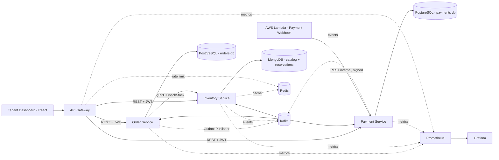
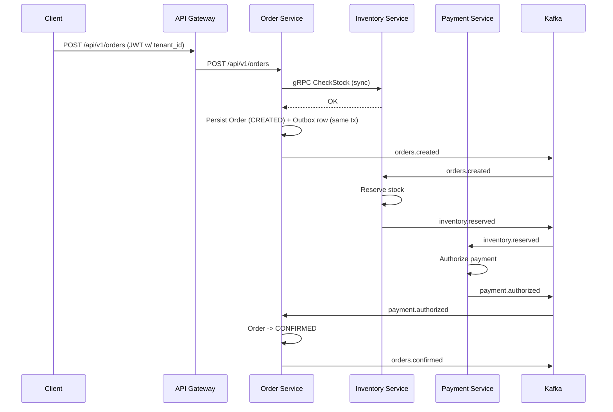

# OrderFlow — Architecture Documentation

> Living document. Update incrementally at the end of each implementation phase.

---

## 1. System Overview

**OrderFlow** is a multi-tenant, event-driven order fulfillment platform, delivered as SaaS. Multiple stores (tenants) use OrderFlow to process orders, manage inventory, and handle payments through a choreographed Saga running on Kafka. It is a portfolio project demonstrating production-grade patterns for microservices, event-driven architecture, multi-tenancy, and hybrid sync/async service communication.

Conceptually, OrderFlow is "fulfillment infrastructure as a service" — a simplified version of what a platform like Shopify's order pipeline does internally, exposed as a product other businesses subscribe to.

## 2. Design Goals

Each major technical decision below fits a genuine constraint or trade-off in the problem, not an arbitrary pick:

| Decision | Rationale |
|---|---|
| 3 independent Spring Boot services + Gateway | Order, Inventory, and Payment have distinct scaling profiles, failure modes, and ownership boundaries — a natural service decomposition. |
| Kafka as the event backbone | Multiple independent downstream reactions per order event (inventory, payment, audit), each needing its own consumer scaling and replay semantics. |
| Choreographed Saga with compensation | No single service owns the full order lifecycle; each reacts only to what it needs to know and compensates independently. |
| Transactional Outbox pattern | Avoids the dual-write problem between Postgres and Kafka — a committed order must never silently fail to reach the event log. |
| MongoDB for the product catalog | Category-specific attributes (clothing vs. electronics) don't fit a fixed relational schema well. |
| gRPC for Order → Inventory stock check | The one call in the system where the caller needs an immediate answer before proceeding — a poor fit for eventual consistency. |
| JWT with `tenant_id` claim + row-level isolation | Each tenant's data must stay isolated without provisioning separate infrastructure per tenant. |
| AWS Lambda for the payment webhook | Bursty, stateless, cold-start-tolerant traffic — a textbook serverless workload. |
| Redis for rate limiting + catalog cache | Plan enforcement and hot-read caching both need low-latency state shared across service instances. |
| Prometheus/Grafana across all services | A distributed system needs cross-service visibility; per-service logs alone don't show saga-wide behavior. |

## 3. High-Level Architecture



## 4. Repository Layout (Monorepo)

```
orderflow/
├── pom.xml                        # Parent POM (dependency & plugin management)
├── common/                        # Shared DTOs, event envelopes, proto contracts
│   └── src/main/proto/inventory.proto
├── api-gateway/                   # Spring Cloud Gateway, JWT validation, rate limiting
├── order-service/                 # Order lifecycle, Outbox, Saga reactions
├── inventory-service/             # Catalog (Mongo), stock reservation, gRPC server
├── payment-service/                # Payment authorization, webhook ingestion
├── serverless/
│   └── payment-webhook-lambda/    # Node.js, deployed independently (NOT a Maven module)
├── frontend/                      # React + Vite tenant dashboard
├── infra/
│   └── docker-compose.yml         # Kafka, Postgres, Mongo, Redis, Prometheus, Grafana
├── docs/
│   └── ARCHITECTURE.md
└── README.md
```

## 5. Domain Services

### 5.1 API Gateway
- Spring Cloud Gateway. Single public entry point.
- Validates JWT (OAuth2 Resource Server), extracts `tenant_id` and `roles`, forwards them as trusted internal headers (`X-Tenant-Id`, `X-User-Id`) to downstream services.
- Enforces per-tenant rate limiting via Redis (token bucket), based on the tenant's plan.
- **Trade-off noted:** edge validation + trusted internal network is simpler than per-hop mTLS/zero-trust; documented as a future hardening step (§16).

### 5.2 Order Service
- Owns the `Order` and `OrderItem` aggregates (PostgreSQL).
- Calls Inventory Service via **gRPC** (`CheckStock`) synchronously before creating an order — a fast, blocking pre-check unrelated to the async reservation that follows.
- Writes the order **and** an `OutboxEvent` row in the same transaction (Transactional Outbox pattern), avoiding the dual-write problem between Postgres and Kafka.
- A `@Scheduled` Outbox Publisher polls unsent rows (~every 500ms) and publishes to Kafka, marking them as sent.
- Owns `Tenant` and `Plan` (FREE/PRO) as an embedded module — not a separate microservice, to keep scope contained. Documented as an extraction candidate in §16.
- Reacts to `inventory.reservation-failed`, `payment.failed` → publishes compensating `orders.cancelled`.
- Reacts to `payment.authorized` → transitions order to `CONFIRMED`.

### 5.3 Inventory Service
- Owns `Product` (MongoDB) — flexible schema justified by category-specific attributes (e.g., clothing has size/color, electronics has voltage/warranty).
- Owns `StockReservation` (MongoDB) with a `RESERVED → CONFIRMED | RELEASED` lifecycle and a TTL-based auto-release safety net.
- Exposes a **gRPC** server (`CheckStock`) for the synchronous pre-check from Order Service.
- Consumes `orders.created` → attempts reservation → publishes `inventory.reserved` or `inventory.reservation-failed`.
- Consumes `orders.cancelled` → releases the reservation (compensation).
- Caches hot catalog reads in Redis (short TTL, invalidated on stock mutation).

### 5.4 Payment Service
- Owns `Payment` (PostgreSQL).
- Consumes `inventory.reserved` → authorizes payment (simulated or real Stripe test-mode — see §16) → publishes `payment.authorized` or `payment.failed`.
- Exposes a secured internal endpoint `POST /internal/v1/payment-webhook` (validated via shared-secret header), called by the Lambda when the external payment provider confirms capture asynchronously. Persists the result and publishes `payment.captured`.

### 5.5 Serverless: Payment Webhook Function
- AWS Lambda (**Node.js** — chosen for lower cold-start latency and mature tooling for lightweight, event-triggered webhook receivers, rather than reusing Java here).
- Triggered by API Gateway (AWS), validates the webhook signature, forwards the verified payload to Payment Service's internal endpoint.
- Kept stateless and dependency-light; does not talk to Kafka directly (avoids requiring MSK/Confluent Cloud access from Lambda — noted as a production upgrade path in §16).

## 6. Multi-Tenancy Model

- Every entity/collection across all services carries a `tenantId` field.
- **PostgreSQL (Order, Payment):** row-level isolation enforced via a Hibernate `@FilterDef`/`@Filter` bound to a request-scoped `TenantContext`, populated by a servlet filter reading the trusted `X-Tenant-Id` header from the Gateway.
- **MongoDB (Inventory):** no built-in filter mechanism — tenant scoping is enforced manually at the repository/service boundary and verified by integration tests (every query method takes `tenantId` explicitly).
- JWTs are issued with a `tenant_id` claim. OrderFlow ships its **own minimal JWT issuer** for standalone use, but the Resource Server config (`issuer-uri`) is designed to be swapped for **GateKeeper** (the centralized Auth Hub project) without code changes — just configuration.

## 7. Event-Driven Architecture

### 7.1 Kafka Topics

| Topic | Producer | Consumer(s) |
|---|---|---|
| `orders.created` | Order Service (via Outbox) | Inventory Service |
| `inventory.reserved` | Inventory Service | Payment Service |
| `inventory.reservation-failed` | Inventory Service | Order Service |
| `payment.authorized` | Payment Service | Order Service |
| `payment.failed` | Payment Service | Order Service |
| `payment.captured` | Payment Service | Order Service |
| `orders.cancelled` | Order Service | Inventory Service |
| `orders.confirmed` | Order Service | (audit / future consumers) |

Naming convention: `<domain>.<event-in-past-tense>`, kebab-case.

### 7.2 Event Envelope Schema

```json
{
  "eventId": "uuid",
  "eventType": "orders.created",
  "tenantId": "uuid",
  "occurredAt": "2026-07-08T12:00:00Z",
  "payload": { }
}
```

### 7.3 Saga Flow (Choreography) — Happy Path



**Design decision — choreography over orchestration:** chosen over a central Saga orchestrator to keep services independently deployable, with no shared coordinator as a single point of failure. The trade-off — harder to visualize overall saga state, no single source of truth for "where is this order in the flow" — is mitigated by the `processed_events`/audit trail (§12) and the dashboard's Saga timeline view (§13).

### 7.4 Compensation & Failure Handling

If `inventory.reservation-failed` or `payment.failed` arrives at any point, Order Service publishes `orders.cancelled`. Inventory Service reacts by releasing any held reservation. This is the compensating transaction of the Saga.

### 7.5 Idempotency

Every consumer maintains a `processed_events` table/collection with a unique index on `eventId`. Before processing, the consumer checks whether the event was already handled and skips if so. Mandatory for all Kafka listeners.

### 7.6 Outbox Pattern

Implemented via a polling publisher for this project's current scope (simple, explainable, no extra infrastructure). Debezium/CDC is noted as the production-grade alternative (§16).

### 7.7 Dead Letter Topics

Spring Kafka's `DefaultErrorHandler` + `DeadLetterPublishingRecoverer` routes messages that fail after retries to `<topic>.DLT`. Mirrors the retry/DLQ philosophy already used in MCNE (RabbitMQ), adapted to Kafka.

## 8. Synchronous Communication (gRPC)

Order Service → Inventory Service `CheckStock` is the only synchronous inter-service call in the system. Chosen because the client needs an immediate answer before committing to order creation — a case where eventual consistency is the wrong fit. Everything else is async via Kafka.

Proto contracts live in `common/src/main/proto/`, shared across services via the Maven module.

## 9. Authentication & Authorization

- OAuth2 Resource Server, JWT bearer tokens, validated at the Gateway.
- Claims: `sub` (user id), `tenant_id`, `roles`.
- Internal service-to-service trust boundary: Gateway-forwarded headers (documented trade-off, §5.1).
- Lambda → Payment Service internal webhook: shared-secret header (`X-Internal-Api-Key`), not JWT (machine-to-machine, out of tenant context).

## 10. Caching Strategy

| Use case | Mechanism |
|---|---|
| Per-tenant plan rate limiting | Redis token bucket, keyed `tenant:{id}:orders:{yyyy-MM}` |
| Product catalog hot reads | Redis, short TTL, invalidated on stock mutation |

## 11. Observability

Every service exposes `/actuator/prometheus` via Micrometer. Grafana dashboards track: Saga completion rate, per-service p99 latency, Kafka consumer lag, per-tenant order volume, DLT message count.

## 12. Data Architecture

### 12.1 PostgreSQL (`orders` db — Order Service)
- `orders` (id UUID, tenant_id, customer_id, status, total_amount, created_at, updated_at)
- `order_items` (id, order_id, product_id, quantity, unit_price)
- `outbox_events` (id, aggregate_id, event_type, payload, tenant_id, created_at, sent_at)
- `tenants` (id, name, plan, created_at)
- `processed_events` (event_id PK, processed_at)

### 12.1b PostgreSQL (`payments` db — Payment Service)
- `payments` (id, order_id, tenant_id, amount, status, provider, external_reference, created_at)
- `processed_events` (event_id PK, processed_at)

### 12.2 MongoDB (Inventory Service)
- `products` (_id, tenantId, sku, name, category, attributes: object, price, stockQuantity)
- `stock_reservations` (_id, orderId, tenantId, productId, quantity, status, expiresAt)
- `processed_events` (_id = eventId)

## 13. Frontend Dashboard

React + Vite, dark glassmorphic theme (Outfit/Inter typography, gradient accents, soft shadows). Views: tenant login, live order list, **Saga timeline per order** (visual state machine: CREATED → INVENTORY_RESERVED → PAYMENT_AUTHORIZED → CONFIRMED, or the cancelled/compensating branch), plan usage indicator.

## 14. Local Infrastructure & Ports

| Service | Port | Notes |
|---|---|---|
| PostgreSQL | 5436 | Single instance, separate DBs per service |
| MongoDB | 27018 | Non-default, avoids collision with any local install |
| Redis | 6379 | Default |
| Kafka (KRaft, single broker) | 9092 | Default, no Zookeeper needed |
| Kafka UI | 8089 | Optional, for local topic inspection |
| Prometheus | 9090 | Default |
| Grafana | 3000 | Default |
| API Gateway | 8090 | Public entry point |
| Order Service | 8091 | |
| Inventory Service | 8092 (REST) / 9095 (gRPC) | |
| Payment Service | 8093 | |
| Frontend (Vite dev) | 5175 | Distinct from MCNE/Cognitive Vault frontends |
| Lambda (local, serverless-offline) | 3001 | |

None of these collide with MCNE (Postgres 5435, RabbitMQ 5672/15672, app 8081) or Cognitive Vault (Postgres 5434, MinIO 9000/9001, Elasticsearch 9200) — all three can run simultaneously.

## 15. Technology Stack Summary

| Layer | Technology |
|---|---|
| Language | Java 21 (Order, Inventory, Payment, Gateway) + Node.js (Lambda) |
| Framework | Spring Boot 4.1.0 (Spring Framework 7.0.8) |
| Cloud | Spring Cloud 2025.1.2 "Oakwood", Spring Cloud Gateway 5.0.1 |
| Messaging | Apache Kafka (KRaft mode) |
| Sync RPC | gRPC (Spring Boot 4.1 native support — verify current config against live docs at implementation time) |
| Relational DB | PostgreSQL 16 |
| NoSQL DB | MongoDB |
| Cache | Redis |
| Auth | OAuth2 / JWT (Spring Security Resource Server) |
| Serverless | AWS Lambda + API Gateway |
| Observability | Micrometer, Prometheus, Grafana |
| Frontend | React 19 + Vite |
| Testing | JUnit 5, Mockito, Testcontainers (Postgres, Mongo, Kafka) |
| Build | Maven (multi-module) |
| Containerization | Docker / Docker Compose |

## 16. Design Trade-offs & Future Improvements

- Gateway-level JWT validation with trusted internal headers, instead of per-hop mTLS — noted zero-trust upgrade path.
- Polling-based Outbox publisher instead of Debezium CDC — simpler for this project's current scope, CDC noted as production upgrade.
- Tenant/Plan management embedded in Order Service instead of a dedicated Billing Service — extraction candidate if load justified it.
- Lambda calls Payment Service via internal REST instead of publishing to Kafka directly — avoids requiring MSK access from Lambda; noted as a scaling consideration.
- Consider swapping the simulated payment provider for **real Stripe test-mode webhooks** — free, and exercises actual webhook signature verification and payload handling instead of a hand-rolled approximation.
- Choreographed Saga instead of an orchestrator — intentional EDA-first choice; an orchestrated version (e.g., with a `SagaOrchestrator` state machine or Temporal) trades independence for centralized visibility, worth revisiting if the number of saga branches grows.
